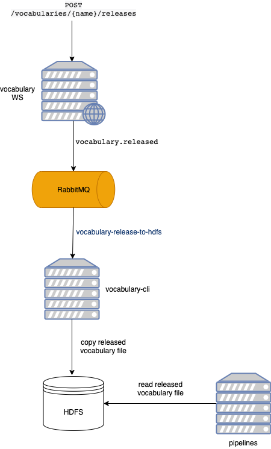

# Vocabulary CLI

This modules includes CLI applications for the vocabularies.

## vocabulary-release-to-hdfs

This CLI listens for the `vocabulary.released` rabbitMQ messages and copies the released vocabulary 
to the HDFS directory where pipelines reads the vocabularies from during the interpretation.

The process can be summarized as this:

